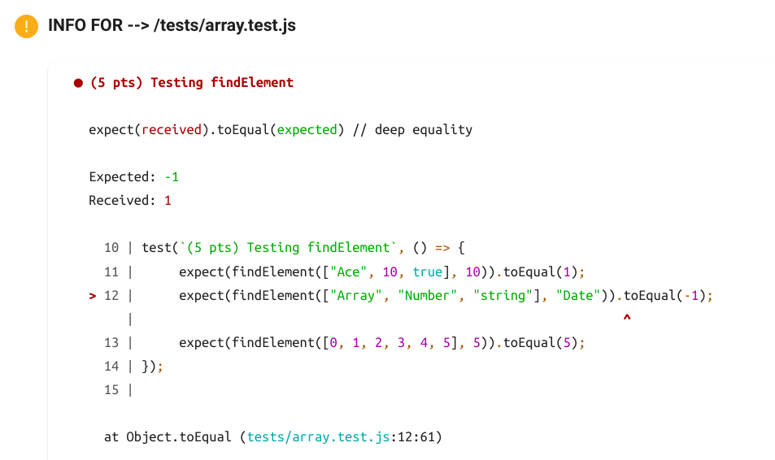

# JS Assignments

As a part of this assignment, you would have to complete some simple javascript functions present in the `src` directory!

To run the project:

1. Fork and clone the repository.
2. Install [NodeJS](https://nodejs.org/en) on your system.
3. Run `npm i`.
4. Solve the tasks!
5. You can view your progress by running the command `npm run test` and then viewing the file `index.html`!
6. When done, push the same to GitHub and create a Pull Request to submit your work.

## How to implement assignments

Tasks modules are located in the **src** folder. Each module consists of several tasks for specified topic. Each task is usually a regular function:

```javascript
/**
 * Returns the result of concatenation of two strings.
 *
 * @param {string} value1
 * @param {string} value2
 * @return {string}
 *
 * @example
 *   'aa', 'bb' => 'aabb'
 *   'aa',''    => 'aa'
 *   '',  'bb'  => 'bb'
 */
function concatenateStrings(value1, value2) {
	throw new Error("Not implemented");
}
```

- Read the task description in the comment above the function. Try to understand the idea. The comments clearly document what the inputs to the function are, and what should it's return value be.
- Remove the throwing error line from function body

```javascript
throw new Error("Not implemented");
```

and run the unit tests again using `npm run test`.

- Find the test corresponding to the function in the opened Test Results page. You can see the `points` associated with the particular test on the webpage.
- Clicking on the header corresponging to the test would also give you additonal information about the failing cases!
  
  For example, in this screenshot, we can see that the `findElement` function is failing on the call `findElement(["Array", "Number", "string"], "Date")` as the same is returning the value `1`, while the value `-1` was expected!
- Implement the function using your JS knowledge and verify your solution by running tests until the failed test passes (becomes green).
- Even after your solution passes, try to refactor it! Try to make your code as pretty and simple as possible keeping the tests green!
